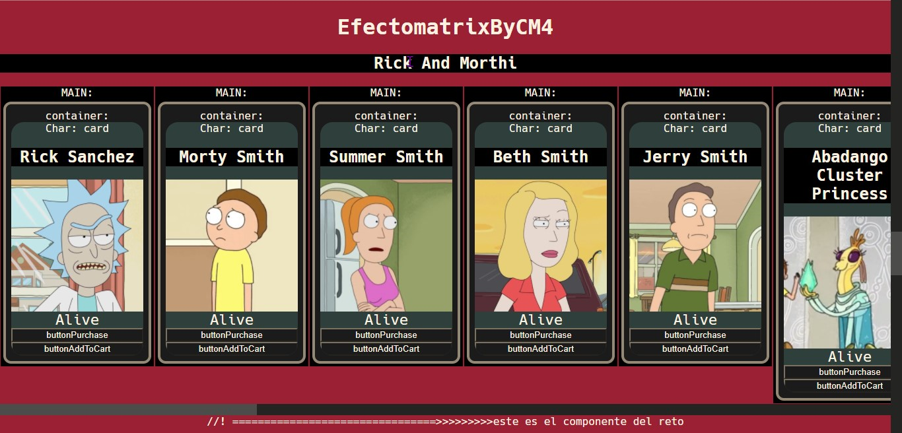

# Bienvenido....
#### Esta es era una practica mezcla de componentes para tener varios tipos de efectos matrix de background en VSC, y un dia no sabia donde meter mas componentes y me puse a meterlos en este repo jajajaj
## This file has created with nodeMachine by CheatModes4

# EFECTO MATRIX
# Effect1 
###
### por ahora solo esta el componente AVO que era para hacerle fetching a otra API pero resulté usando la de rick and morthy mañana lo arreglo jajaja

## la practica xD

